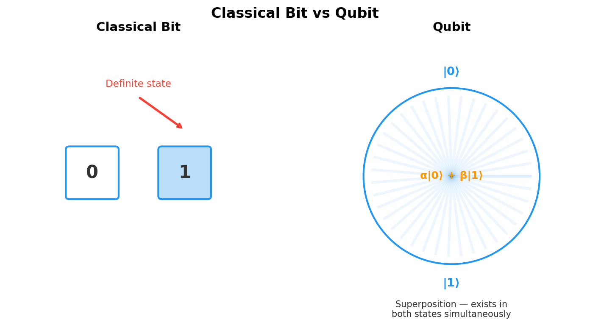
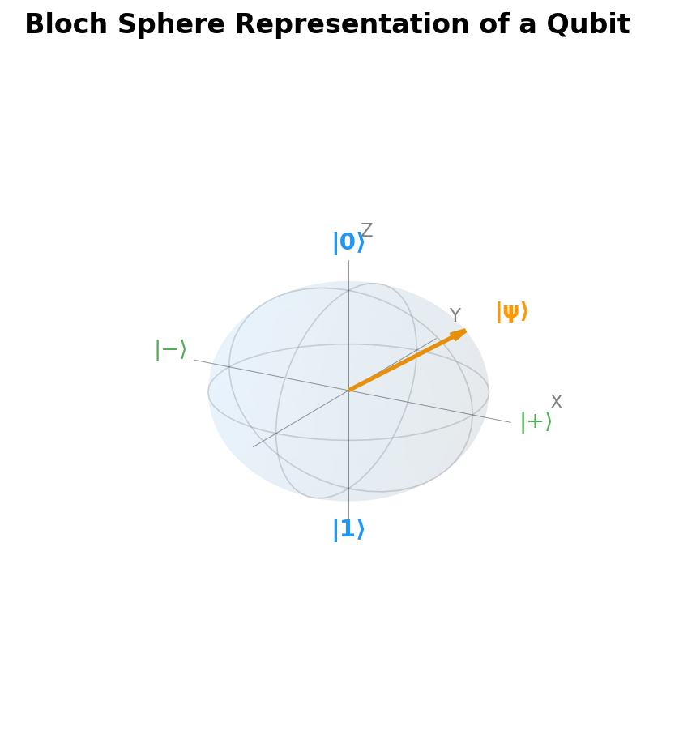

# Chapter 1: What Is a Qubit?

*The fundamental building block that makes quantum computing possible*

## Introduction

If you want to understand quantum computing, it all starts here — with a single qubit. It's the quantum version of a classical bit, but calling it "just a quantum bit" is like calling a jet engine "just a fan." The underlying concept is so different from what we're used to that it takes a minute to wrap your head around it.

This chapter lays the foundation for everything that follows. We'll see how qubits differ from classical bits — not just mathematically, but in the kinds of things they let you compute. Fair warning: some of this will feel strange. That's normal. Quantum mechanics is strange.

## Classical Bits: The Digital Foundation

Before we go quantum, let's make sure we're on the same page about the classical world. In traditional computing, information lives in **bits** — binary digits that can be either 0 or 1. Simple, reliable, boring (in the best way).

### Properties of Classical Bits

**Definiteness**: At any given moment, a classical bit has a definite value. It's either 0 or 1, never both, never something in between. Think of a coin sitting on a table — it's either heads or tails, with no ambiguity.

**Copyability**: Classical bits can be copied perfectly. If you have a bit with value 1, you can create as many identical copies as needed, each with the same value 1. This property is so fundamental to classical computing that we rarely think about it.

**Measurability**: Reading a classical bit doesn't change its state. You can check whether a bit is 0 or 1 repeatedly, and you'll always get the same answer. The act of observation is passive.

**Reversible and Irreversible Operations**: While some classical operations are reversible (like NOT, which flips 0↔1), others are irreversible (like AND, where you can't determine the inputs from the output alone).

### Classical Information Processing

With N classical bits, you can represent exactly 2^N different states, but you can only be in **one** of these states at any given time. For example:
- 3 bits can represent 8 different values: 000, 001, 010, 011, 100, 101, 110, 111
- But at any moment, those 3 bits encode exactly one of these values

This has been plenty powerful — classical bits gave us the entire digital revolution, after all. But it becomes a bottleneck for certain problems that need to explore many solution paths at once. Enter the qubit.

## Enter the Qubit

A **qubit** (quantum bit) breaks every rule we just laid out. Instead of being stuck as either 0 or 1, a qubit can exist in a **superposition** of both states simultaneously. If that sounds weird — good. It is. But it's also experimentally verified to a ludicrous degree of precision, so we just have to roll with it.

### The Mathematical Representation

A qubit state is mathematically described as:

**|ψ⟩ = α|0⟩ + β|1⟩**

Where:
- **|ψ⟩** represents the quantum state (using Dirac "bra-ket" notation)
- **α** and **β** are complex numbers called **probability amplitudes**
- **|0⟩** and **|1⟩** are the basis states (equivalent to classical 0 and 1)
- The constraint **|α|² + |β|² = 1** ensures total probability equals 1

Don't let the notation scare you — this just says the qubit is a blend of |0⟩ and |1⟩, and when you measure it, you get 0 with probability |α|² and 1 with probability |β|².

### Key Properties of Qubits

**Superposition**: Unlike classical bits, qubits can exist in any combination of |0⟩ and |1⟩. This isn't uncertainty about which state it's "really" in — the qubit genuinely exists in both states simultaneously until measured.

**Probability Amplitudes**: The coefficients α and β aren't just probabilities — they're probability amplitudes that can be complex numbers. This allows for **quantum interference**, where amplitudes can add constructively or destructively.

**Measurement Collapse**: When you measure a qubit, the superposition collapses to either |0⟩ (with probability |α|²) or |1⟩ (with probability |β|²). The act of measurement fundamentally changes the quantum state.

**Phase Information**: The relative phase between α and β carries information that has no classical analog. Two qubits might have the same measurement probabilities but different quantum behavior due to phase differences. This turns out to be enormously important — we'll explore it in depth in [Chapter 2](chapter-02-phase-interference-measurement.md).

### The Coin Analogy (And Its Limitations)

A popular analogy compares a classical bit to a coin lying flat (heads or tails) and a qubit to a spinning coin that's simultaneously both heads and tails until it lands. While helpful for intuition, this analogy has limitations:

**What the analogy captures well**:
- Superposition: The spinning coin is in both states
- Measurement: Observing forces a definite outcome
- Probability: The coin lands heads or tails with certain odds

**What the analogy misses**:
- Complex amplitudes and quantum phase
- The ability to manipulate superposition states coherently
- Entanglement between multiple qubits
- The fact that superposition isn't just "hidden information" but fundamentally different physics

A more accurate analogy might be a coin that exists in a quantum superposition where "heads" and "tails" can interfere with each other like waves, creating patterns that have no classical equivalent.

## The Bloch Sphere: Visualizing Qubit States

The **Bloch sphere** provides an elegant geometric representation of all possible qubit states. Imagine a sphere with radius 1, where every point on the surface represents a valid qubit state.

### Key Features of the Bloch Sphere

- **North Pole**: Represents the |0⟩ state
- **South Pole**: Represents the |1⟩ state
- **Equator**: Contains all equal superposition states
- **Any Point on Surface**: A valid qubit state with specific probabilities and phase

### Coordinates and Parameterization

Any qubit state can be written as:

**|ψ⟩ = cos(θ/2)|0⟩ + e^(iφ)sin(θ/2)|1⟩**

Where θ (theta) and φ (phi) are the spherical coordinates:
- **θ**: Polar angle from north pole (determines probability split)
- **φ**: Azimuthal angle around sphere (determines relative phase)

### Why the Bloch Sphere Matters

**Infinite States**: While a classical bit has 2 possible states, a qubit has **infinite** possible states — every point on a continuous sphere surface.

**Geometric Operations**: Quantum gates correspond to rotations on the Bloch sphere, providing intuitive visualization of quantum operations (as we'll see in [Chapter 3](chapter-03-gates-circuits.md)).

**Measurement**: Measuring in the |0⟩/|1⟩ basis projects the state onto the north-south axis.

**Superposition Visualization**: Points on the equator represent equal superpositions with different phases.

## Why Qubits Change Everything

The power of qubits comes not just from individual quantum behavior, but from how multiple qubits interact and scale.

### Exponential State Space Growth

While N classical bits can represent one of 2^N possible values at a time, N qubits can exist in a superposition of **all** 2^N basis states simultaneously:

- **3 classical bits**: Can store one of 8 values (000, 001, 010, etc.)
- **3 qubits**: Can exist in superposition of all 8 basis states simultaneously

This scaling becomes dramatic quickly:
- **10 qubits**: 1,024 basis states in superposition
- **50 qubits**: 1.125 × 10¹⁵ basis states (more than a petabyte of classical information)
- **300 qubits**: More basis states than there are atoms in the observable universe

### Quantum Parallelism

This exponential scaling enables **quantum parallelism** — the ability to perform operations on all superposed states simultaneously. A quantum algorithm can explore exponentially many solution paths in parallel, then use quantum interference to amplify correct answers and cancel incorrect ones.

### The Fragility Factor

However, this power comes with a critical limitation: **decoherence**. Quantum superposition states are extremely fragile and can be destroyed by:

- **Environmental interaction**: Heat, electromagnetic fields, vibrations
- **Measurement**: Observing the system collapses superposition
- **Imperfect operations**: Noise in quantum gates introduces errors

Current qubits maintain their quantum properties for only microseconds to milliseconds, making quantum computation a race against decoherence. We'll explore how quantum error correction tackles this challenge in [Chapter 6](chapter-06-error-correction.md).

## Chapter Summary

Qubits represent a fundamental departure from classical information processing:

1. **Superposition** allows qubits to exist in multiple states simultaneously
2. **The Bloch sphere** visualizes the infinite possible qubit states
3. **Probability amplitudes** — complex numbers — give qubits richer structure than classical probabilities
4. **Exponential scaling** gives quantum systems enormous computational potential
5. **Decoherence** is the fundamental challenge that makes quantum computing so difficult to engineer

In the next chapter, we'll explore the concepts that turn superposition from a curiosity into a computational powerhouse: **phase**, **interference**, and **measurement**.

---

## References & Further Reading

- **Preskill's Caltech Lecture Notes (Ph219)** — Comprehensive mathematical foundations of qubits and quantum states: [Caltech Ph219](http://theory.caltech.edu/~preskill/ph219/ph219_2023-24/)
- **Qiskit Textbook** — Interactive lessons on qubits, Bloch sphere, and measurement: [IBM Quantum Learning](https://learning.quantum.ibm.com/)
- **Scott Aaronson, "Quantum Computing Since Democritus"** — Chapter 9 covers qubits from a computer science perspective: [Lecture Notes](https://www.scottaaronson.com/democritus/)
- **Nielsen & Chuang, "Quantum Computation and Quantum Information"** — The standard textbook, Chapter 1 covers the mathematical foundations
