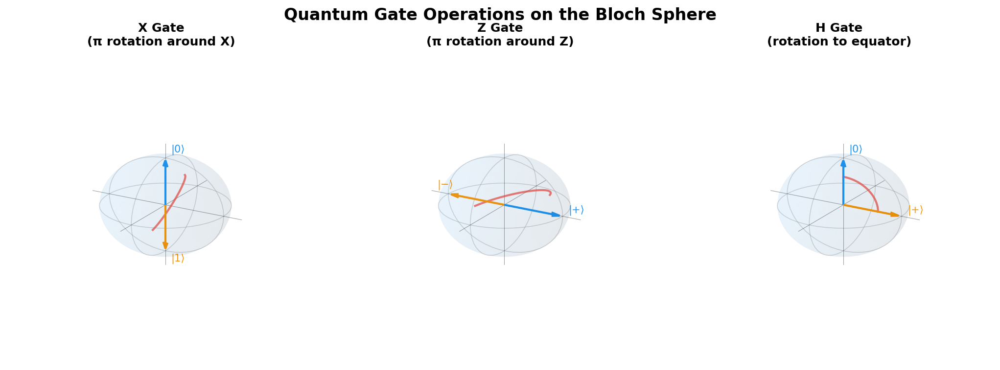
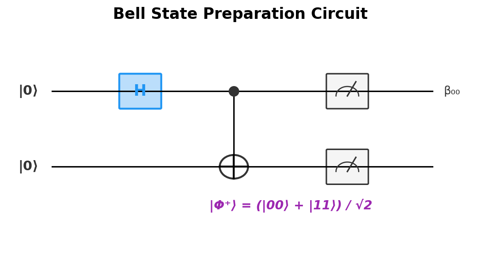

# Chapter 3: Quantum Gates & Circuits

*The quantum toolbox for manipulating qubits*

## Introduction

We've got qubits ([Chapter 1](chapter-01-qubits.md)) and we understand the physics that makes them powerful — phase, interference, measurement ([Chapter 2](chapter-02-phase-interference-measurement.md)). Great. But how do we actually *do things* with them?

This is where quantum gates come in. Just as classical computers use logic gates (AND, OR, NOT) to manipulate bits, quantum computers use **quantum gates** to manipulate qubits. Think of them as the verbs of quantum computing — the actions you can perform on qubits to sculpt interference patterns and coax out useful answers.

## Fundamental Principles of Quantum Gates

Before we get into specific gates, there are a few ground rules that every quantum operation must follow. These aren't arbitrary — they come straight from the physics.

### Unitarity: The Quantum Constraint

All quantum gates (except measurement) must be **unitary operations**. Mathematically, this means the gate is represented by a unitary matrix U, where U†U = I (the dagger † denotes complex conjugate transpose).

**What unitarity means physically:**
- **Reversibility**: Every quantum gate can be undone by applying its inverse
- **Probability preservation**: The total probability remains 1 after the operation
- **Length preservation**: The "distance" between quantum states is preserved

**Why this matters:**
- Information cannot be created or destroyed in quantum operations
- All quantum computations (except measurement) are reversible
- This constraint limits which operations are possible but ensures physical consistency

### Quantum Gates as Rotations

On the Bloch sphere, quantum gates correspond to **rotations**. Every single-qubit gate rotates the qubit state to a new position on the sphere:

- **Pauli gates**: 180° rotations around different axes
- **Hadamard gate**: 180° rotation around the X+Z axis
- **Phase gates**: Rotations around the Z-axis
- **Arbitrary rotations**: Any rotation on the sphere is a valid quantum gate

### Gate Composition and Circuits

Quantum gates can be composed sequentially to create more complex operations. The mathematical representation involves matrix multiplication:

If gates U₁ and U₂ are applied sequentially, the combined operation is U₂U₁ (note the reverse order — rightmost gate applied first).

## The Pauli Gates: Fundamental Single-Qubit Operations



The **Pauli gates** (X, Y, Z) are the most fundamental single-qubit gates, named after physicist Wolfgang Pauli. They form the building blocks for more complex operations.

### The X Gate (Quantum NOT)

**Matrix representation:**
```
X = [0 1]
    [1 0]
```

**Action:**
- X|0⟩ = |1⟩
- X|1⟩ = |0⟩
- X(α|0⟩ + β|1⟩) = α|1⟩ + β|0⟩

**Bloch sphere interpretation**: 180° rotation around the X-axis

**Classical analog**: The NOT gate — flips 0↔1

**Key properties:**
- **Self-inverse**: XX = I (applying twice returns to original state)
- **Bit-flip**: Changes computational basis states |0⟩↔|1⟩
- **Preserves superposition**: Superposition states remain in superposition

### The Y Gate

**Matrix representation:**
```
Y = [0 -i]
    [i  0]
```

**Action:**
- Y|0⟩ = i|1⟩
- Y|1⟩ = -i|0⟩
- Y(α|0⟩ + β|1⟩) = -iβ|0⟩ + iα|1⟩

**Bloch sphere interpretation**: 180° rotation around the Y-axis

**Effect**: Both bit-flip AND phase-flip — like applying X and Z gates simultaneously.

**Key properties:**
- **Self-inverse**: YY = I
- **Complex operation**: Introduces imaginary numbers into amplitudes
- **Combined effect**: Equivalent to iXZ up to global phase

### The Z Gate (Phase Flip)

**Matrix representation:**
```
Z = [1  0]
    [0 -1]
```

**Action:**
- Z|0⟩ = |0⟩
- Z|1⟩ = -|1⟩
- Z(α|0⟩ + β|1⟩) = α|0⟩ - β|1⟩

**Bloch sphere interpretation**: 180° rotation around the Z-axis

**Effect**: **Phase flip** — leaves |0⟩ unchanged, adds minus sign to |1⟩.

**Key insight**: While classical gates only manipulate probabilities, the Z gate manipulates quantum **phase** — the hidden information we explored in [Chapter 2](chapter-02-phase-interference-measurement.md) that drives interference and, ultimately, quantum speedups.

## The Hadamard Gate: Creating Superposition

The **Hadamard gate** is arguably the most important single-qubit gate in quantum computing. It creates equal superposition states and enables quantum parallelism.

### Mathematical Definition

**Matrix representation:**
```
H = (1/√2)[1  1]
           [1 -1]
```

**Action:**
- H|0⟩ = (|0⟩ + |1⟩)/√2 ≡ |+⟩
- H|1⟩ = (|0⟩ - |1⟩)/√2 ≡ |-⟩

### Creating Superposition

Starting with a definite state |0⟩, the Hadamard gate creates an equal superposition:

**Before**: |0⟩ (definitely 0)
**After**: (|0⟩ + |1⟩)/√2 (50% chance of 0, 50% chance of 1)

This is the quantum equivalent of "flipping a fair coin" — but the qubit remains in superposition until measured.

### The Hadamard Basis

The Hadamard gate defines its own measurement basis:
- **|+⟩ = (|0⟩ + |1⟩)/√2**: The "plus state"
- **|-⟩ = (|0⟩ - |1⟩)/√2**: The "minus state"

These states are **eigenstates** of the X operator, meaning X|+⟩ = |+⟩ and X|-⟩ = -|-⟩.

### Reversibility and Self-Inverse Property

The Hadamard gate is **self-inverse**: HH = I

This means:
- H(H|0⟩) = H|+⟩ = |0⟩
- H(H|1⟩) = H|-⟩ = |1⟩

**Geometric interpretation**: The Hadamard gate corresponds to a 180° rotation around the axis that bisects the X and Z axes on the Bloch sphere.

### Quantum Parallelism Foundation

When applied to n qubits initially in |0⟩⊗n, n Hadamard gates create:

H⊗n|0⟩⊗n = (1/√2ⁿ)Σ|x⟩

This superposition contains all 2ⁿ possible n-bit strings simultaneously, enabling quantum algorithms to process all possible inputs in parallel.

## Phase Gates: Fine-Grained Control

Beyond the discrete 180° rotations of Pauli gates, we need gates that provide more precise control over quantum phases.

### The S Gate (Phase Gate)

**Matrix representation:**
```
S = [1 0]
    [0 i]
```

**Action:**
- S|0⟩ = |0⟩
- S|1⟩ = i|1⟩

**Effect**: Adds a 90° phase shift to the |1⟩ component.

### The T Gate (π/8 Gate)

**Matrix representation:**
```
T = [1    0   ]
    [0 e^(iπ/4)]
```

**Action:**
- T|0⟩ = |0⟩
- T|1⟩ = e^(iπ/4)|1⟩

**Effect**: Adds a 45° phase shift to the |1⟩ component.

**A note on naming**: Despite being called the "π/8 gate," it actually applies a π/4 phase rotation. The name comes from factoring the matrix as e^(iπ/8) times a diagonal matrix — a historical convention that can be confusing.

**Special importance**: The T gate is crucial for achieving **universal quantum computation**. While Hadamard and CNOT gates can create many useful operations, adding the T gate makes the gate set capable of approximating any quantum operation to arbitrary precision.

### Arbitrary Single-Qubit Rotations

The most general single-qubit gates are parametric rotations:

- **Rotation around X-axis**: Rx(θ) = cos(θ/2)I - i sin(θ/2)X
- **Rotation around Y-axis**: Ry(θ) = cos(θ/2)I - i sin(θ/2)Y
- **Rotation around Z-axis**: Rz(θ) = cos(θ/2)I - i sin(θ/2)Z

These allow continuous control over qubit rotations, essential for implementing arbitrary quantum algorithms.

## Two-Qubit Gates: Creating Entanglement

Single-qubit gates, no matter how sophisticated, cannot create entanglement. For that, we need **two-qubit gates** that allow qubits to interact.

### The CNOT Gate (Controlled-NOT)

The **CNOT gate** is the most fundamental two-qubit gate and the primary tool for creating entanglement.

**Matrix representation** (4×4 for two qubits):
```
CNOT = [1 0 0 0]
       [0 1 0 0]
       [0 0 0 1]
       [0 0 1 0]
```

**Truth table**:
- |00⟩ → |00⟩ (control=0, target unchanged)
- |01⟩ → |01⟩ (control=0, target unchanged)
- |10⟩ → |11⟩ (control=1, flip target)
- |11⟩ → |10⟩ (control=1, flip target)

**Action**: If the control qubit is |1⟩, apply X gate to target qubit; otherwise do nothing.

### Creating Bell States with CNOT



The CNOT gate's true power emerges when combined with superposition:

**Bell state preparation**:
1. Start with |00⟩
2. Apply H to first qubit: (|0⟩ + |1⟩)|0⟩/√2 = (|00⟩ + |10⟩)/√2
3. Apply CNOT: (|00⟩ + |11⟩)/√2

The result is maximally entangled — measuring the first qubit instantly determines the second qubit's state, regardless of physical separation. We'll explore entanglement in detail in [Chapter 4](chapter-04-entanglement.md).

### Properties of CNOT

- **Reversibility**: CNOT is self-inverse (CNOT·CNOT = I)
- **Asymmetry**: Control and target qubits play different roles
- **Entangling**: Can create entanglement from product states
- **Classical behavior**: On computational basis states, behaves like classical controlled-NOT

### Other Important Two-Qubit Gates

**Controlled-Z (CZ)**: Applies Z gate to target if control is |1⟩
- Symmetric unlike CNOT (control and target are interchangeable)
- Matrix: diag(1, 1, 1, -1)

**Controlled Phase (CPhase)**: Adds phase φ to |11⟩ state only
- Generalizes CZ gate to arbitrary phases
- Crucial for many quantum algorithms

**SWAP Gate**: Exchanges the states of two qubits
- SWAP|ab⟩ = |ba⟩
- Can be constructed from three CNOT gates

## Universal Gate Sets

A **universal gate set** is a finite collection of gates that can approximate any quantum operation to arbitrary precision. This is quantum computing's equivalent to classical computing's universal gate sets (like NAND gates).

### Common Universal Sets

**{H, T, CNOT}**: The most theoretically important universal set
- **H**: Creates superposition
- **T**: Provides necessary phase control
- **CNOT**: Creates entanglement

**{Ry(θ), CNOT}**: Popular in practice
- **Ry(θ)**: Arbitrary single-qubit rotations (parameterized)
- **CNOT**: Two-qubit entangling gate

### Why the T Gate is Special

The T gate deserves special attention:

- **Transcendental**: Its matrix elements involve e^(iπ/4), an irrational number
- **Non-Clifford**: Unlike H and CNOT, T is not in the Clifford group
- **"Magic"**: Provides the ingredient needed to go beyond efficient classical simulation
- **Fault-tolerance challenge**: Extremely difficult to implement fault-tolerantly

### Gate Compilation

Real quantum algorithms must be **compiled** from abstract operations into sequences of gates from the universal set:

1. **Decomposition**: Breaking complex operations into simple gates
2. **Approximation**: Using finite sequences to approximate arbitrary rotations
3. **Optimization**: Minimizing gate count and circuit depth
4. **Hardware mapping**: Adapting to specific qubit connectivity constraints

## Quantum Circuits: The Assembly Language

Quantum circuits provide a visual and mathematical framework for describing quantum computations.

### Circuit Notation

- **Horizontal lines**: Represent individual qubits (time flows left to right)
- **Boxes**: Single-qubit gates
- **Connected symbols**: Multi-qubit gates (CNOT shown as ⊕ with control line)
- **Measurement**: Meter symbols
- **Classical bits**: Double lines (for storing measurement results)

### Example: Bell State Circuit

```
|0⟩ ——[H]——●——[📊]—— classical bit 0
             │
|0⟩ ————————⊕——[📊]—— classical bit 1
```

This circuit:
1. Applies Hadamard to first qubit
2. Uses first qubit to control NOT on second qubit
3. Measures both qubits

### Circuit Properties

- **Acyclicity**: No feedback loops (quantum circuits are directed acyclic graphs)
- **Parallelism**: Gates on different qubits can execute simultaneously
- **Depth**: Maximum number of sequential gates (critical for decoherence)
- **Width**: Number of qubits required

### Circuit Equivalence

Many different circuits can implement the same quantum operation:

- **Gate identities**: H·X·H = Z (Hadamard conjugates X into Z)
- **Commutation**: Gates on different qubits commute
- **Cancellation**: Gate followed by inverse cancels out

Circuit optimization uses these equivalences to minimize resource requirements.

## Advanced Gate Concepts

### Controlled Operations

Any single-qubit gate can be made into a controlled operation:
- **Controlled-U**: Applies gate U to target if control is |1⟩
- **Multiple controls**: Toffoli gate (CCNOT) has two control qubits
- **Arbitrary controls**: Can condition on |0⟩ or |1⟩ states

### Parametric Gates

Many quantum gates accept continuous parameters:
- **Rotation gates**: Rx(θ), Ry(θ), Rz(θ)
- **Phase gates**: Rϕ(φ) = diag(1, e^(iφ))
- **Applications**: Variational quantum algorithms, analog quantum simulation

### Gate Fidelity and Errors

Real quantum gates are imperfect:
- **Coherent errors**: Systematic rotation errors
- **Incoherent errors**: Random noise (decoherence)
- **Gate fidelity**: Measure of how close actual gate is to ideal
- **Error models**: Depolarizing, amplitude damping, dephasing

## Quantum vs Classical Gates

| Property | Classical Gates | Quantum Gates |
|----------|----------------|---------------|
| **Reversibility** | Often irreversible | Always reversible |
| **Information** | Discrete (0 or 1) | Continuous (amplitudes) |
| **Copying** | Can copy states | No-cloning theorem |
| **Measurement** | Non-destructive | Destructive |
| **Parallelism** | Sequential processing | Quantum parallelism |

## Chapter Summary

Quantum gates provide the fundamental operations for quantum computation:

1. **Single-qubit gates** manipulate individual qubits through rotations on the Bloch sphere
2. **Pauli gates** (X, Y, Z) provide basic bit-flip and phase-flip operations
3. **Hadamard gate** creates superposition, enabling quantum parallelism
4. **Two-qubit gates** like CNOT create entanglement between qubits
5. **Universal gate sets** allow approximation of arbitrary quantum operations
6. **Quantum circuits** provide a framework for composing gates into algorithms

The reversible, unitary nature of quantum gates preserves quantum information while enabling complex manipulations of superposition and entanglement.

In the next chapter, we'll explore the quantum phenomenon that these gates create and that makes quantum computing truly powerful: **entanglement**.

---

## References & Further Reading

- **Qiskit Textbook** — Hands-on quantum gate tutorials with runnable code: [IBM Quantum Learning](https://learning.quantum.ibm.com/)
- **Preskill's Caltech Lecture Notes (Ph219)** — Rigorous treatment of quantum gates and universality: [Caltech Ph219](http://theory.caltech.edu/~preskill/ph219/ph219_2023-24/)
- **Nielsen & Chuang, "Quantum Computation and Quantum Information"** — Chapters 4–5 cover quantum circuits and universality in detail
