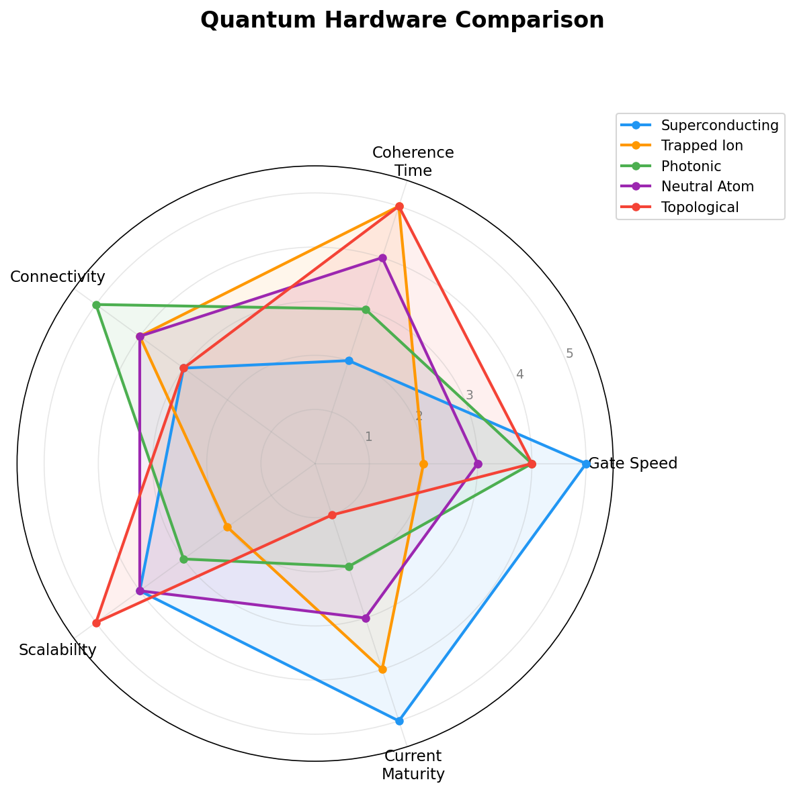

# Chapter 7: Hardware Approaches

*Different paths to the same revolutionary goal*

## Introduction

Building a quantum computer is an extraordinary engineering challenge. The physics is sound, but making it work at scale requires pushing the boundaries of materials science, cryogenics, optics, and control systems. Multiple approaches are being pursued worldwide, each with unique advantages and trade-offs. This chapter focuses on the **physics and engineering** of each approach — for who's building what and how far they've come, see [Chapter 10: The Major Players](chapter-10-major-players.md).

## Superconducting Qubits

**How they work**:
- **Josephson junctions**: Superconducting loops with weak links create artificial atoms
- **Quantum oscillator**: Discrete energy levels act as qubit states
- **|0⟩ and |1⟩**: Different energy states of the oscillator
- **Control**: Microwave pulses at specific frequencies manipulate qubit states

**Advantages**:
- **Fast gates**: ~10–50 nanoseconds per operation
- **Mature fabrication**: Built using semiconductor industry lithography techniques
- **Scalability potential**: Manufacturing processes are compatible with mass production
- **Strong coupling**: Relatively easy to create two-qubit gates between neighboring qubits

**Challenges**:
- **Ultra-cold operation**: Requires dilution refrigerators at ~0.01 K (colder than outer space)
- **Short coherence**: T1 ~100 μs, T2 ~50 μs — a few thousand gate operations at most
- **Crosstalk**: Qubits can inadvertently influence neighbors through stray microwave fields
- **Control complexity**: Each qubit needs individual control lines, creating a wiring bottleneck at scale

**Best suited for**: Near-term applications requiring fast gate speeds and leveraging existing semiconductor infrastructure. Currently the most mature platform.

## Trapped Ion Qubits

**How they work**:
- **Ion trapping**: Electric fields suspend individual ions in ultra-high vacuum
- **Qubit states**: Different electron energy levels within the ion
- **Laser control**: Precisely tuned lasers drive transitions between qubit states
- **Phonon coupling**: Shared vibrational modes of the ion chain mediate two-qubit interactions

**Advantages**:
- **Identical qubits**: Every ion of a given species is physically identical — no manufacturing variation
- **Long coherence**: Coherence times of seconds to minutes (orders of magnitude better than superconducting)
- **High fidelity**: Two-qubit gate fidelities above 99.5%
- **Full connectivity**: Any qubit can interact with any other (via shared motional modes or ion shuttling)

**Challenges**:
- **Slow gates**: ~10–100 microseconds (roughly 1,000× slower than superconducting)
- **Complex control**: Requires precisely aligned laser systems and ultra-high vacuum
- **Scaling difficulties**: Trapping thousands of ions in a single chain becomes impractical; modular architectures (ion shuttling, photonic interconnects) are needed
- **Laser addressing**: Targeting individual ions without affecting neighbors requires extreme precision

**Best suited for**: Applications where qubit quality and connectivity matter more than raw speed — chemistry simulations, small-scale algorithms requiring high fidelity.

## Photonic Qubits

**How they work**:
- **Qubit encoding**: Photon properties (polarization, path, time-bin) encode quantum states
- **Linear optics**: Beam splitters, phase shifters, and mirrors manipulate photons
- **Detection**: Single-photon detectors determine measurement outcomes
- **Entanglement**: Generated through nonlinear optical processes or photon "fusion"

**Advantages**:
- **Room temperature optics**: Photonic circuits don't need cryogenic cooling (though detectors do)
- **Natural networking**: Photons travel at light speed through fiber optics — ideal for distributed quantum computing
- **Low decoherence**: Photons barely interact with the environment
- **Semiconductor-compatible**: Some approaches use standard chip fabrication

**Challenges**:
- **Photon loss**: Photons can be absorbed or scattered, losing quantum information
- **Probabilistic gates**: Two-photon interactions are inherently random — must be compensated with error correction
- **Resource overhead**: May need millions of photons for each logical qubit
- **Detection efficiency**: Current single-photon detectors aren't perfect (~95–98%)

**Best suited for**: Quantum networking, distributed quantum computing, and potentially large-scale fault-tolerant computing through fusion-based architectures.

## Topological Qubits

**How they work**:
- **Anyons**: Exotic quasiparticles that exist only in two-dimensional systems
- **Braiding**: Moving anyons around each other performs quantum operations
- **Topological protection**: Quantum information is stored in global properties of the system, not local states
- **Majorana fermions**: A specific type of anyon being pursued as the basis for topological qubits

**Theoretical advantages**:
- **Intrinsic error correction**: Topology naturally protects quantum information against local noise
- **Longer coherence**: Less sensitive to local perturbations
- **Stable gates**: Operations defined by global topology rather than precise analog control
- **Lower overhead**: Potentially far fewer physical qubits per logical qubit

**Challenges**:
- **Exotic physics**: Requires creating and manipulating quasiparticles that have only recently been demonstrated
- **Unproven at scale**: No large-scale demonstrations yet
- **Complex materials**: Needs specialized semiconductor heterostructures
- **Limited gate set**: Natural topological operations may not be universal — additional non-topological gates may be needed

**Best suited for**: Long-term fault-tolerant quantum computing — if the physics and engineering challenges are solved, this approach could dramatically reduce the overhead for error correction.

## Neutral Atom Qubits

**How they work**:
- **Optical tweezers**: Tightly focused laser beams trap individual neutral atoms
- **Qubit states**: Different electron energy levels (ground and excited states)
- **Rydberg interactions**: Exciting atoms to high-energy Rydberg states creates strong, controllable interactions for two-qubit gates
- **Reconfigurable arrays**: Atoms can be physically moved with optical tweezers to create arbitrary connectivity patterns

**Advantages**:
- **Scalable arrays**: Adding more atoms is relatively straightforward compared to fabricating additional circuit elements
- **Reconfigurable connectivity**: Atom positions can be rearranged on-the-fly
- **Good coherence**: Seconds of coherence time in optical traps
- **Fast Rydberg gates**: Strong interactions enable relatively fast two-qubit operations

**Challenges**:
- **Atom loss**: Atoms can escape the traps
- **Rydberg cross-talk**: Strong Rydberg interactions can affect unintended neighbors
- **Readout fidelity**: State detection is still improving
- **Relatively young platform**: Less mature than superconducting and trapped ion approaches

**Best suited for**: Quantum simulation, optimization problems, and potentially large-scale fault-tolerant computing due to favorable scaling properties.

## Other Approaches

**Silicon spin qubits**:
- Electron spins in silicon quantum dots
- Compatible with existing semiconductor manufacturing (CMOS-like)
- Extremely small — potentially very high qubit density
- Early stage but industrially attractive due to fabrication compatibility

**NV centers (diamond)**:
- Nitrogen-vacancy defects in diamond crystals
- Room temperature operation with long coherence times
- Difficult to scale and connect — mainly used for quantum sensing
- Promising for quantum networking as spin-photon interfaces

## Comparing the Approaches

| Property | Superconducting | Trapped Ions | Photonic | Topological | Neutral Atoms |
|----------|----------------|-------------|----------|-------------|---------------|
| **Gate speed** | ~20 ns | ~10–100 μs | ~1 ns (linear) | TBD | ~1 μs |
| **Coherence** | ~100 μs | Seconds–minutes | Low loss | Potentially long | Seconds |
| **Connectivity** | Nearest-neighbor | All-to-all | Flexible | TBD | Reconfigurable |
| **Operating temp** | ~10 mK | Room temp (trap) | Room temp (optics) | ~10 mK | ~μK |
| **Maturity** | Most mature | Mature | Growing | Early | Growing fast |

**The reality**: No single approach is clearly winning. Different platforms excel for different applications. The likely outcome is a heterogeneous future — specialized systems working together, perhaps superconducting processors connected by photonic networks, with different hardware optimized for different problem types.

In the next chapter, we'll see how these hardware platforms are performing in the race to demonstrate quantum advantage.

---

## References & Further Reading

- **Preskill, J.** (2018). "Quantum Computing in the NISQ Era and Beyond" — Hardware landscape and near-term prospects: [PDF](references/preskill-nisq-2018.pdf) | [arXiv](https://arxiv.org/abs/1801.00862)
- **Arute, F. et al.** (2019). "Quantum supremacy using a programmable superconducting processor" — Superconducting approach demonstration: [PDF](references/google-supremacy-2019.pdf) | [arXiv](https://arxiv.org/abs/1911.00577)
- **Fowler, A.G. et al.** (2012). "Surface codes" — Architecture for large-scale quantum computation: [PDF](references/fowler-surface-codes-2012.pdf) | [arXiv](https://arxiv.org/abs/1208.0928)
