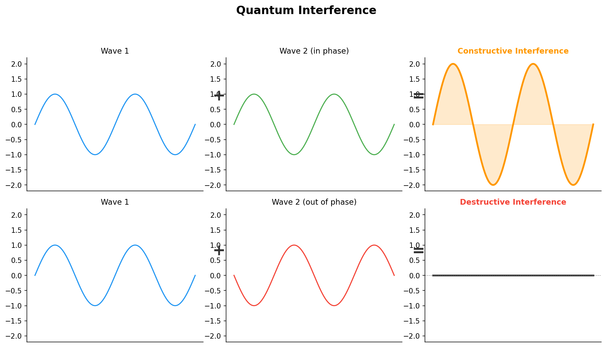
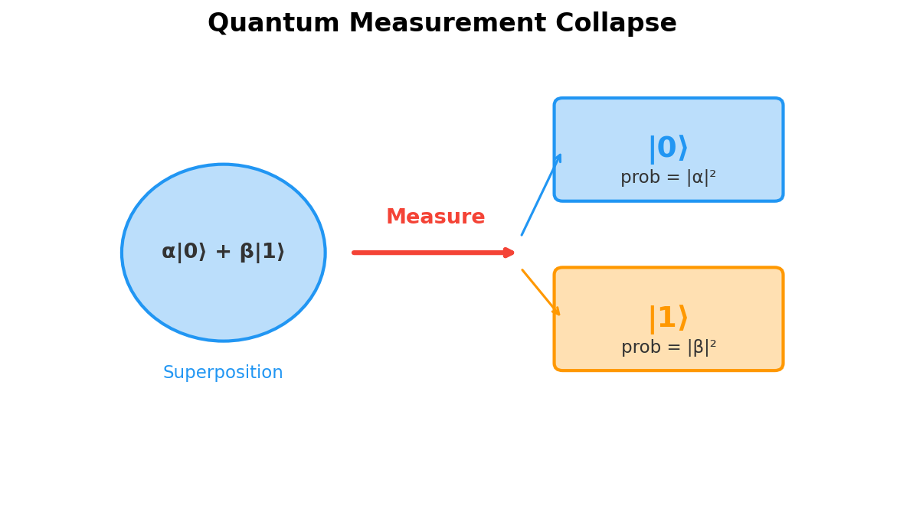

# Chapter 1: What Is a Qubit?

*The fundamental building block that makes quantum computing magical*

## Introduction

At the heart of every quantum computer lies a concept so fundamentally different from classical computing that it challenges our everyday understanding of information itself. The **qubit** (quantum bit) represents a paradigm shift from the deterministic world of classical bits to the probabilistic, superposition-rich realm of quantum mechanics.

To understand quantum computing, we must first grasp how qubits differ from classical bits, not just in their mathematical description, but in their fundamental behavior and the types of information processing they enable. This chapter lays the foundation for understanding all of quantum computing by exploring the nature of qubits, their representation, and why they provide exponentially more computational power than their classical counterparts.

## Classical Bits: The Digital Foundation

Before diving into the quantum world, let's establish our classical baseline. In traditional computing, information is stored and processed using **bits** - binary digits that can exist in one of exactly two states: 0 or 1.

### Properties of Classical Bits

**Definiteness**: At any given moment, a classical bit has a definite value. It's either 0 or 1, never both, never something in between. This is like a coin sitting on a table - it's either heads or tails, with no ambiguity.

**Copyability**: Classical bits can be copied perfectly. If you have a bit with value 1, you can create as many identical copies as needed, each with the same value 1. This property is so fundamental to classical computing that we rarely think about it.

**Measurability**: Reading a classical bit doesn't change its state. You can check whether a bit is 0 or 1 repeatedly, and you'll always get the same answer. The act of observation is passive.

**Reversible and Irreversible Operations**: While some classical operations are reversible (like NOT, which flips 0↔1), others are irreversible (like AND, where you can't determine the inputs from the output alone).

### Classical Information Processing

With N classical bits, you can represent exactly 2^N different states, but you can only be in **one** of these states at any given time. For example:
- 3 bits can represent 8 different values: 000, 001, 010, 011, 100, 101, 110, 111
- But at any moment, those 3 bits encode exactly one of these values

This limitation, while enabling the entire digital revolution, becomes a fundamental bottleneck for certain types of problems that require exploring multiple solution paths simultaneously.

## Enter the Qubit: Quantum's Revolution

A **qubit** (quantum bit) shatters every assumption we just made about classical bits. Instead of being confined to either 0 or 1, a qubit can exist in a **superposition** of both states simultaneously.

### The Mathematical Representation

A qubit state is mathematically described as:

**|ψ⟩ = α|0⟩ + β|1⟩**

Where:
- **|ψ⟩** represents the quantum state (using Dirac "bra-ket" notation)
- **α** and **β** are complex numbers called **probability amplitudes**
- **|0⟩** and **|1⟩** are the basis states (equivalent to classical 0 and 1)
- The constraint **|α|² + |β|² = 1** ensures total probability equals 1

This equation tells us that the qubit exists in a superposition of the |0⟩ and |1⟩ states, with the probability of measuring 0 being |α|² and the probability of measuring 1 being |β|².

### Key Properties of Qubits

**Superposition**: Unlike classical bits, qubits can exist in any combination of |0⟩ and |1⟩. This isn't uncertainty about which state it's "really" in - the qubit genuinely exists in both states simultaneously until measured.

**Probability Amplitudes**: The coefficients α and β are not just probabilities - they're probability amplitudes that can be complex numbers. This allows for **quantum interference**, where amplitudes can add constructively or destructively.

**Measurement Collapse**: When you measure a qubit, the superposition collapses to either |0⟩ (with probability |α|²) or |1⟩ (with probability |β|²). The act of measurement fundamentally changes the quantum state.

**Phase Information**: The relative phase between α and β carries information that has no classical analog. Two qubits might have the same measurement probabilities but different quantum behavior due to phase differences.

### The Coin Analogy (And Its Limitations)

A popular analogy compares a classical bit to a coin lying flat (heads or tails) and a qubit to a spinning coin that's simultaneously both heads and tails until it lands. While helpful for intuition, this analogy has limitations:

**What the analogy captures well**:
- Superposition: The spinning coin is in both states
- Measurement: Observing forces a definite outcome
- Probability: The coin lands heads or tails with certain odds

**What the analogy misses**:
- Complex amplitudes and quantum phase
- The ability to manipulate superposition states coherently
- Entanglement between multiple qubits
- The fact that superposition isn't just "hidden information" but fundamentally different physics

A more accurate analogy might be a coin that exists in a quantum superposition where "heads" and "tails" can interfere with each other like waves, creating patterns that have no classical equivalent.

## The Bloch Sphere: Visualizing Qubit States

The **Bloch sphere** provides an elegant geometric representation of all possible qubit states. Imagine a sphere with radius 1, where every point on the surface represents a valid qubit state.

### Key Features of the Bloch Sphere

**North Pole**: Represents the |0⟩ state
**South Pole**: Represents the |1⟩ state
**Equator**: Contains all equal superposition states
**Any Point on Surface**: A valid qubit state with specific probabilities and phase

### Coordinates and Parameterization

Any qubit state can be written as:
**|ψ⟩ = cos(θ/2)|0⟩ + e^(iφ)sin(θ/2)|1⟩**

Where θ (theta) and φ (phi) are the spherical coordinates:
- **θ**: Polar angle from north pole (determines probability split)
- **φ**: Azimuthal angle around sphere (determines relative phase)

### Why the Bloch Sphere Matters

**Infinite States**: While a classical bit has 2 possible states, a qubit has **infinite** possible states - every point on a continuous sphere surface.

**Geometric Operations**: Quantum gates correspond to rotations on the Bloch sphere, providing intuitive visualization of quantum operations.

**Measurement**: Measuring in the |0⟩/|1⟩ basis projects the state onto the north-south axis.

**Superposition Visualization**: Points on the equator represent equal superpositions with different phases.

## What Is Quantum Phase?

Phase is the most unintuitive aspect of quantum mechanics — it's information that's invisible to direct measurement, yet it controls everything about how a qubit behaves.

### The Wave Analogy

Think of two ocean waves approaching a seawall. Both waves have the same height (amplitude) and the same frequency, but one arrives a fraction of a second after the other — they're **out of phase**. When they meet:

- **In phase** (crests aligned): They combine into a bigger wave. This is **constructive interference**.
- **Out of phase** (crest meets trough): They cancel each other out. This is **destructive interference**.

The height of each wave is like the probability amplitude of a qubit. The timing offset is the **phase**. You can't tell the phase by looking at one wave in isolation — but the moment two waves interact, phase determines everything.

### Phase in a Qubit

A qubit state |ψ⟩ = α|0⟩ + β|1⟩ has two complex amplitudes. Each complex number has a magnitude (how big) and a phase angle (which direction it points in the complex plane). The **relative phase** between α and β is what matters.

Consider these two states:
- **State A**: (|0⟩ + |1⟩)/√2
- **State B**: (|0⟩ − |1⟩)/√2

If you measure either state, you get 0 or 1 with exactly 50% probability each. They look **identical** through measurement. But they are fundamentally different quantum states — State B has a **π phase flip** on the |1⟩ component.

This difference is invisible to a single measurement in the computational basis, but it becomes visible through **interference**. Apply a Hadamard gate:
- **State A → |0⟩** (with certainty)
- **State B → |1⟩** (with certainty)

The phase, which seemed hidden, now determines the outcome with 100% certainty. This is the magic trick at the heart of quantum computing.

### The Clock Analogy

Imagine each amplitude as a clock hand:
- The **length** of the hand represents the probability (how likely you are to measure that state)
- The **angle** of the hand represents the phase

Two qubits can have their clock hands pointing at the same length (equal probability) but at different angles (different phases). When quantum gates combine these states, the angles determine whether the hands add up or cancel out — just like waves.

### Why Phase Is the Secret Weapon of Quantum Computing

Phase is what makes quantum computing more than just "probabilistic classical computing":

1. **Interference requires phase**: Without phase differences, there's no constructive or destructive interference — and without interference, there's no quantum speedup
2. **Algorithms sculpt phase**: Every quantum algorithm works by carefully rotating phases so that wrong answers interfere destructively (cancel out) and right answers interfere constructively (amplify)
3. **Phase is fragile**: Environmental noise randomizes phase relationships (this is decoherence), which is why quantum computers need such extreme isolation
4. **Phase has no classical analog**: Classical probability has no concept of "negative probability" or "complex probability" — phase is what gives quantum mechanics its extra computational power

### Global Phase vs Relative Phase

One subtle but important distinction:

- **Global phase**: Multiplying the entire state by e^(iθ) — e.g., changing |ψ⟩ to e^(iθ)|ψ⟩. This is **physically unobservable** and has no effect on any measurement. It's a mathematical artifact.
- **Relative phase**: The phase difference between components — e.g., the difference between (|0⟩ + |1⟩)/√2 and (|0⟩ + e^(iθ)|1⟩)/√2. This is **physically meaningful** and affects interference patterns.

On the Bloch sphere, global phase is invisible (it doesn't change the point's position), while relative phase corresponds to the **longitude** (azimuthal angle φ) — rotating the qubit around the equator.

This is why a qubit has two real degrees of freedom (θ and φ on the Bloch sphere), not four, even though α and β together contain four real numbers. Normalization removes one degree of freedom, and global phase removes another.

## Measuring a Qubit: Collapsing the Quantum State

Measurement is one of the most profound aspects of quantum mechanics — the act of extracting information from a qubit fundamentally and irreversibly changes it.

### What Happens During Measurement

When a qubit in state |ψ⟩ = α|0⟩ + β|1⟩ is measured in the computational basis:

1. **Probabilistic outcome**: You get either 0 (with probability |α|²) or 1 (with probability |β|²)
2. **State collapse**: The qubit's superposition is destroyed — it snaps to whichever state was observed
3. **Irreversibility**: The original amplitudes α and β are gone forever. You cannot reconstruct them from a single measurement
4. **Repeatability**: Measuring the same qubit again immediately gives the same result (it's now in a definite state)

### The Born Rule

The **Born rule** is the bridge between quantum amplitudes and real-world probabilities:

- **P(0) = |α|²** — probability of measuring |0⟩
- **P(1) = |β|²** — probability of measuring |1⟩
- **Normalization**: |α|² + |β|² = 1 (probabilities must sum to 1)

For example, a qubit in state (√3/2)|0⟩ + (1/2)|1⟩ gives:
- 75% chance of measuring 0
- 25% chance of measuring 1

### Measurement Bases

You're not limited to measuring in the |0⟩/|1⟩ basis. Any pair of orthogonal states defines a valid measurement basis:

- **Computational basis** (Z-basis): {|0⟩, |1⟩} — the standard, most common
- **Hadamard basis** (X-basis): {|+⟩, |−⟩} — measures superposition phase
- **Y-basis**: {|+i⟩, |−i⟩} — measures circular polarization

Choosing the right measurement basis is critical — the same qubit can give different information depending on how you measure it. This is why quantum algorithms carefully design their measurement strategy.

### How Qubits Are Physically Measured

The abstract "measurement" maps to concrete physical processes depending on the hardware:

- **Superconducting qubits**: A microwave pulse probes the qubit's resonator. The resonator's frequency shifts depending on whether the qubit is in |0⟩ or |1⟩ (dispersive readout). The reflected signal reveals the state.
- **Trapped ions**: A laser tuned to a specific transition causes the ion to fluoresce (glow) if it's in one state, and stay dark in the other. A camera or photodetector counts the photons.
- **Photonic qubits**: Single-photon detectors (avalanche photodiodes or superconducting nanowire detectors) register whether a photon arrived in a particular path or polarization.
- **Neutral atoms**: Similar to trapped ions — state-dependent fluorescence under laser illumination, captured by high-resolution imaging.

**Common challenge across all platforms**: No measurement is perfect. Readout errors (1–5%) mean the detector sometimes reports the wrong state, which is why quantum algorithms run many shots and use statistical analysis.

### The Paradox: Qubits Are Fundamentally Unmeasurable

Here's the deep puzzle at the heart of quantum computing: **you can never fully read out a qubit's state.**

A qubit |ψ⟩ = α|0⟩ + β|1⟩ is described by two complex numbers — that's four real parameters (reduced to two by normalization and global phase). But a single measurement gives you just **one classical bit**: 0 or 1. The rich quantum information — the exact values of α and β, the delicate phase relationships — is destroyed the instant you look.

This isn't a limitation of our instruments. It's a law of physics:
- **No single-shot readout**: One measurement of one qubit can never reveal its full state
- **No cloning workaround**: You can't copy the qubit first and measure the copies (no-cloning theorem)
- **No gentle measurement**: There's no way to "peek" without disturbing the state

**So how does quantum computing work at all?**

The answer is a combination of clever strategies:

1. **Statistical reconstruction (tomography)**: Prepare the *same* state thousands of times, measure each copy in different bases, and statistically reconstruct the probabilities. This tells you about the state, but requires many identical copies — it's used for calibration and verification, not during computation.

2. **Algorithmic design**: Quantum algorithms are crafted so that the answer you care about gets **amplified** to near-certainty before measurement. Grover's algorithm doesn't need to read out the full quantum state — it arranges interference so the correct answer has ~100% probability. You measure once and get the right answer.

3. **Interference before measurement**: The whole point of a quantum circuit is to manipulate amplitudes so that wrong answers cancel out (destructive interference) and right answers reinforce (constructive interference). By the time you measure, the superposition has been sculpted into something useful.

4. **Repeated sampling**: Run the circuit many times, collect statistics. If the algorithm is well-designed, the correct answer appears with overwhelming frequency.

5. **Partial measurement**: Sometimes you measure only some qubits, collapsing part of the system while preserving quantum information in the rest. This is how error correction syndromes work — you learn about errors without touching the data.

**The key insight**: Quantum computing doesn't require reading the full quantum state. It requires designing computations where the answer naturally concentrates into a measurable outcome. The "unmeasurability" of qubits isn't a bug — it's a constraint that quantum algorithms are specifically engineered to work within.

Think of it this way: you can't see the wind, but you can build a sail that harnesses it. Quantum algorithms are sails for quantum states — they capture the computational power of superposition and interference without ever needing to observe the full quantum state directly.

### Why Measurement Matters for Computation

Measurement isn't just the "end" of a quantum computation — it's a strategic tool:

- **Mid-circuit measurement**: Some algorithms measure certain qubits partway through, using the result to decide what gates to apply next (adaptive circuits)
- **Measurement-based quantum computing**: An entire paradigm where computation is performed purely through sequential measurements on a pre-entangled cluster state
- **Error correction**: Syndrome measurements detect errors without disturbing the encoded data (the key trick of quantum error correction)

## Why Qubits Change Everything

The power of qubits comes not just from individual quantum behavior, but from how multiple qubits interact and scale.

### Exponential State Space Growth

While N classical bits can represent one of 2^N possible values at a time, N qubits can exist in a superposition of **all** 2^N basis states simultaneously:

- **3 classical bits**: Can store one of 8 values (000, 001, 010, etc.)
- **3 qubits**: Can exist in superposition of all 8 basis states simultaneously

This scaling becomes dramatic quickly:
- **10 qubits**: 1,024 basis states in superposition
- **50 qubits**: 1.125 × 10¹⁵ basis states (more than a petabyte of classical information)
- **300 qubits**: More basis states than there are atoms in the observable universe

### Quantum Parallelism

This exponential scaling enables **quantum parallelism** - the ability to perform operations on all superposed states simultaneously. A quantum algorithm can explore exponentially many solution paths in parallel, then use quantum interference to amplify correct answers and cancel incorrect ones.

### The Fragility Factor

However, this power comes with a critical limitation: **decoherence**. Quantum superposition states are extremely fragile and can be destroyed by:

- **Environmental interaction**: Heat, electromagnetic fields, vibrations
- **Measurement**: Observing the system collapses superposition
- **Imperfect operations**: Noise in quantum gates introduces errors

Current qubits maintain their quantum properties for only microseconds to milliseconds, making quantum computation a race against decoherence.

## Fundamental Quantum Phenomena

Several key quantum mechanical phenomena distinguish qubits from classical bits:

### Superposition

The ability to exist in multiple states simultaneously. This isn't just theoretical - it's been experimentally verified countless times and is the foundation of quantum computing algorithms.

### Interference

Because probability amplitudes can be complex numbers, they can interfere constructively (amplifying certain outcomes) or destructively (canceling outcomes). This allows quantum algorithms to bias results toward correct answers.

### No-Cloning Theorem

Unlike classical bits, you cannot create perfect copies of an unknown quantum state. This fundamental limitation has profound implications for quantum error correction and quantum cryptography.

### Entanglement (Preview)

Multiple qubits can become correlated in ways that have no classical analog, where measuring one qubit instantly affects the others regardless of physical separation. This "spooky action at a distance" is crucial for many quantum algorithms.

## Practical Qubit Implementations

Qubits aren't abstract mathematical objects - they must be implemented in real physical systems:

### Superconducting Qubits
- **Physical basis**: Superconducting circuits with Josephson junctions
- **|0⟩ and |1⟩**: Different energy states of a quantum harmonic oscillator
- **Control**: Microwave pulses manipulate qubit states
- **Used by**: IBM, Google, Rigetti

### Trapped Ion Qubits
- **Physical basis**: Individual ions trapped by electric fields
- **|0⟩ and |1⟩**: Different electron energy levels within the ion
- **Control**: Precisely tuned laser pulses
- **Used by**: IonQ, Quantinuum

### Photonic Qubits
- **Physical basis**: Photons (particles of light)
- **|0⟩ and |1⟩**: Different photon properties (polarization, path, timing)
- **Control**: Optical elements like beam splitters and wave plates
- **Used by**: Xanadu, PsiQuantum

Each implementation has different coherence times, gate speeds, and connectivity patterns, but all harness the same fundamental quantum mechanical principles.

## Chapter Summary

Qubits represent a fundamental departure from classical information processing:

1. **Superposition** allows qubits to exist in multiple states simultaneously
2. **The Bloch sphere** visualizes the infinite possible qubit states
3. **Exponential scaling** gives quantum systems enormous computational potential
4. **Quantum phenomena** like interference and entanglement enable new types of algorithms
5. **Physical implementations** realize these abstract concepts in real quantum devices

Understanding qubits is essential because every quantum algorithm, every quantum gate, and every quantum computer ultimately manipulates these fundamental quantum information units.

## Key Concepts

- **Qubit**: A two-level quantum system that can exist in superposition
- **Superposition**: The ability to exist in multiple states simultaneously
- **Probability Amplitude**: Complex numbers that determine measurement probabilities
- **Bloch Sphere**: Geometric representation of all possible qubit states
- **Quantum Parallelism**: Processing multiple states simultaneously
- **Decoherence**: The destruction of quantum properties through environmental interaction

## Further Reading

- Nielsen & Chuang, "Quantum Computation and Quantum Information" (Chapter 1)
- Experimental demonstrations of qubit superposition and measurement
- Physical implementations of qubits in various technologies
- The mathematical foundations of quantum mechanics and Hilbert spaces