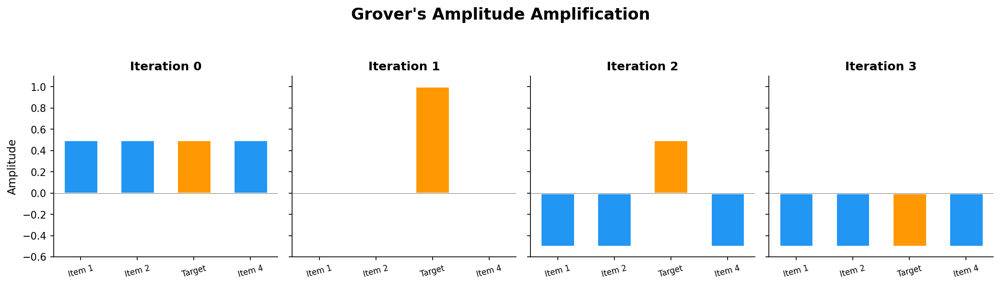

# Chapter 5: Quantum Algorithms

*Where quantum mechanics delivers real computational power*

## Introduction

This is where quantum computing transforms from fascinating physics into practical capability. The algorithms in this chapter showcase **quantum advantage** — solving problems exponentially or quadratically faster than any known classical approach. Each one works by carefully orchestrating the interference effects we explored in [Chapter 2](chapter-2-phase-interference-measurement.md), using the gates from [Chapter 3](chapter-3-gates-circuits.md) on entangled states from [Chapter 4](chapter-4-entanglement.md).

## Deutsch-Jozsa Algorithm: Quantum's First Victory

**The problem**: Given a mystery function f(x) that's either:
- **Constant**: Always returns 0 OR always returns 1
- **Balanced**: Returns 0 for half of inputs, 1 for the other half

**Challenge**: Determine which type f(x) is with minimum function calls.

**Classical approach:**
- **Worst case**: Must check over half the inputs
- **N-bit input**: Up to 2^(N-1) + 1 evaluations needed
- **Example**: 10-bit input — up to 513 function calls

**Quantum approach**:
- Just **1** quantum evaluation — always
- The secret: quantum parallelism evaluates f(x) on all inputs simultaneously

**How it works:**
1. Create superposition of all possible inputs
2. Apply f(x) to the superposition (quantum oracle)
3. Use interference to extract the global property
4. **Single measurement**: Reveals constant vs balanced

**The insight**: We learn a global property of the function without examining individual outputs. The interference pattern after the final Hadamard gates is constructive for one answer and destructive for the other.

## Grover's Search: Finding Needles in Haystacks

**The problem**: Search an **unsorted database** of N items to find a specific target.

**Classical limitation**:
- Random search: Average N/2 checks, worst case N
- No structure to exploit — can't do better than linear search
- Million items: ~500,000 average checks

**Grover's quantum solution**:
- Only **√N** steps needed
- Million items: ~1,000 steps (500× faster)
- Billion items: ~31,623 steps vs 500 million classical

**The algorithm ingredients:**
- **Oracle**: Marks the target item (flips its phase)
- **Amplification**: Grover diffusion operator boosts the marked amplitude
- **Iteration**: Repeat oracle + amplification ~√N times
- **Measurement**: Target item measured with high probability

**Analogy**: Like tuning a radio — each iteration amplifies the signal of the correct answer while dampening the noise of wrong answers. After √N iterations, the target comes through clearly.

**Important nuance**: Grover's provides a *quadratic* speedup, not exponential. It's provably optimal for unstructured search — no quantum algorithm can do better.

## Shor's Algorithm: The Cryptography Breaker

**The problem**: Factor large integers N into prime components (p × q = N).

**Why it matters**:
- **RSA encryption**: Security relies on factoring being computationally hard
- **Current protection**: 2048-bit RSA would take classical computers an astronomically long time
- **Shor's threat**: A sufficiently large quantum computer could break it in hours

**Classical vs Quantum complexity:**
- **Classical**: Sub-exponential time — the general number field sieve, with complexity roughly exp(O(n^(1/3) (log n)^(2/3)))
- **Shor's quantum**: Polynomial time (grows like n³)
- **Example**: 2048-bit number
  - **Classical**: Roughly 10²⁰–10³⁰ years with best known algorithms on current hardware
  - **Quantum**: ~8 hours on a sufficiently large fault-tolerant quantum computer

**The algorithm's genius:**
1. **Transform**: Factoring → finding periods of modular exponentiation
2. **Quantum Fourier Transform**: Finds periods exponentially faster than any known classical method
3. **Classical post-processing**: Extract factors from the period

**Current status**: Only small numbers (up to 21) have been factored on quantum hardware — a far cry from cryptographically relevant sizes. Breaking RSA-2048 would require roughly 4,000 logical qubits (millions of physical qubits with current error correction overhead).

## Common Quantum Algorithm Patterns

**Quantum Parallelism**: All these algorithms exploit superposition to process multiple inputs simultaneously:
- Create superposition of all possible inputs
- Apply the function to the entire superposition at once
- Extract global information through interference

**The Oracle Model**: Many quantum algorithms assume a "black box" function:
- **Oracle**: A quantum circuit implementing f(x)
- **Reversible**: Must work on superpositions without destroying them
- **Implementation**: Often the hardest part in practice

**Interference is key**: As we explored in [Chapter 2](chapter-2-phase-interference-measurement.md), interference is what converts phase information into computational results. Every quantum algorithm carefully choreographs constructive interference on correct answers and destructive interference on wrong ones.

**Quantum Fourier Transform**: The secret weapon in many algorithms:
- **Classical FFT**: Cornerstone of digital signal processing
- **Quantum FFT**: Exponentially faster for finding periods and frequencies
- **Applications**: Shor's algorithm, quantum phase estimation, quantum simulation

**Limitations**: Not every problem has a quantum speedup — only specific structured problems benefit.

## Beyond the Big Three: The Growing Family

**Quantum simulation algorithms**:
- **VQE (Variational Quantum Eigensolver)**: Find ground states of molecules
- **Applications**: Drug discovery, catalyst design, materials science
- **NISQ-friendly**: Designed to work on today's noisy hardware

**Quantum machine learning**:
- **HHL algorithm**: Solves linear systems exponentially faster — but with significant caveats. The input must be efficiently loadable into quantum states, and the output is a quantum state (not a full classical readout). Several proposed QML speedups have been "dequantized" — classical algorithms have been found that match the quantum advantage once the same input/output assumptions are made.
- **Quantum kernel methods**: Map data into quantum feature spaces for classification
- **Honest assessment**: The field is promising but immature. Many claimed speedups have caveats around data loading, readout bottlenecks, or have been partially dequantized. Quantum ML remains an active research area rather than a demonstrated advantage.

**Quantum optimization**:
- **QAOA (Quantum Approximate Optimization Algorithm)**: Approximate solutions to hard optimization problems
- **Real applications**: Supply chain, financial portfolios, scheduling

**The reality check**:
- Most algorithms with proven exponential speedups need fault-tolerant quantum computers
- NISQ-era variational algorithms work on today's machines but with limited circuit depth
- The clearest near-term impact is in quantum simulation of physical systems

**Key insight**: Quantum algorithms don't make everything faster — they provide speedups for **specific, structured problems** that happen to be enormously important.

Of course, all these beautiful algorithms assume perfect qubits — which don't exist. In the next chapter, we'll confront quantum computing's greatest engineering challenge: how to compute reliably with unreliable hardware.

---

## References & Further Reading

- **Shor, P.W.** (1994). "Algorithms for Quantum Computation: Discrete Logarithms and Factoring": [PDF](references/shor-1994.pdf) | [arXiv](https://arxiv.org/abs/quant-ph/9508027)
- **Grover, L.K.** (1996). "A Fast Quantum Mechanical Algorithm for Database Search": [PDF](references/grover-1996.pdf) | [arXiv](https://arxiv.org/abs/quant-ph/9605043)
- **Qiskit Textbook** — Step-by-step algorithm implementations: [IBM Quantum Learning](https://learning.quantum.ibm.com/)
- **Scott Aaronson, "Quantum Computing Since Democritus"** — Computational complexity context for quantum algorithms: [Lecture Notes](https://www.scottaaronson.com/democritus/)
